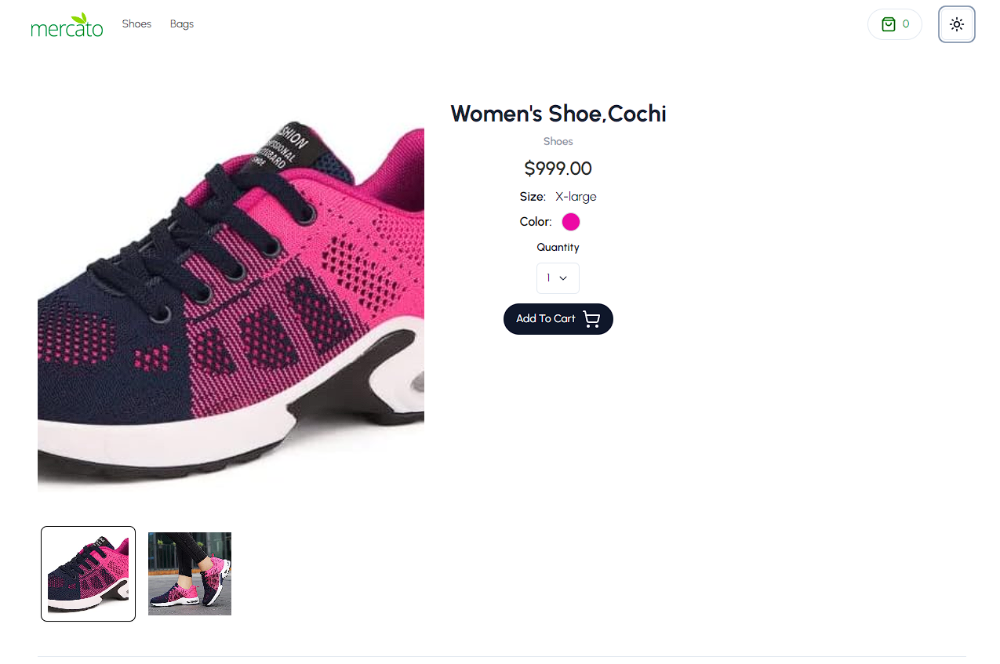
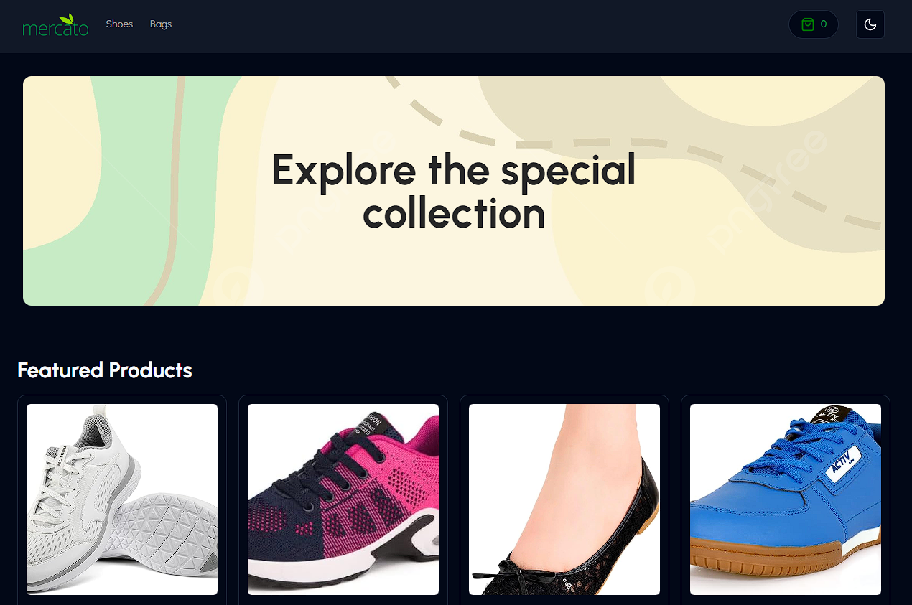
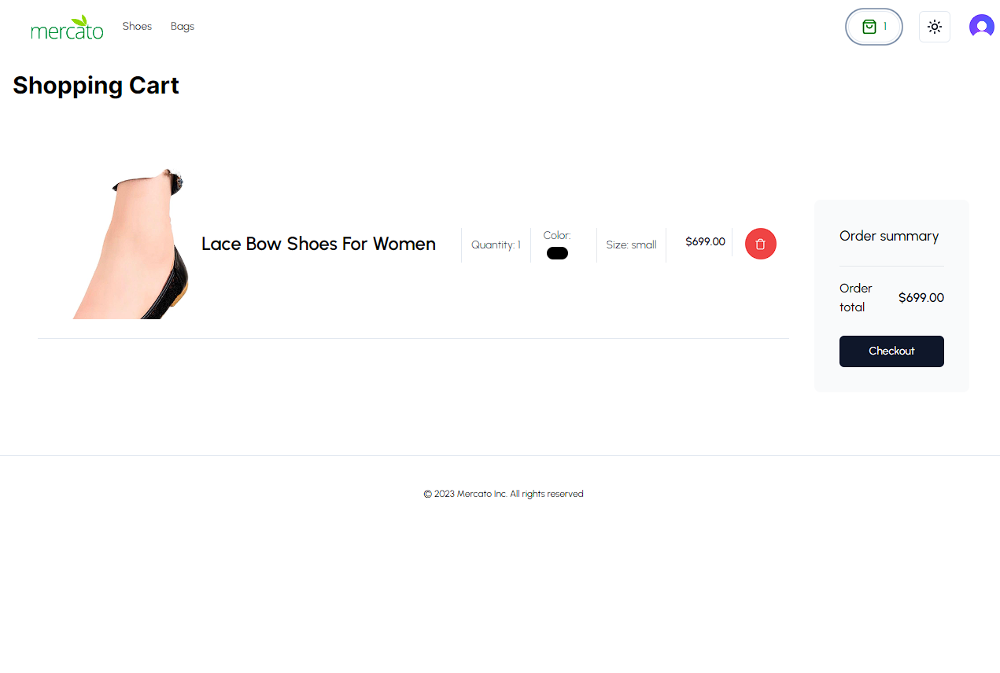
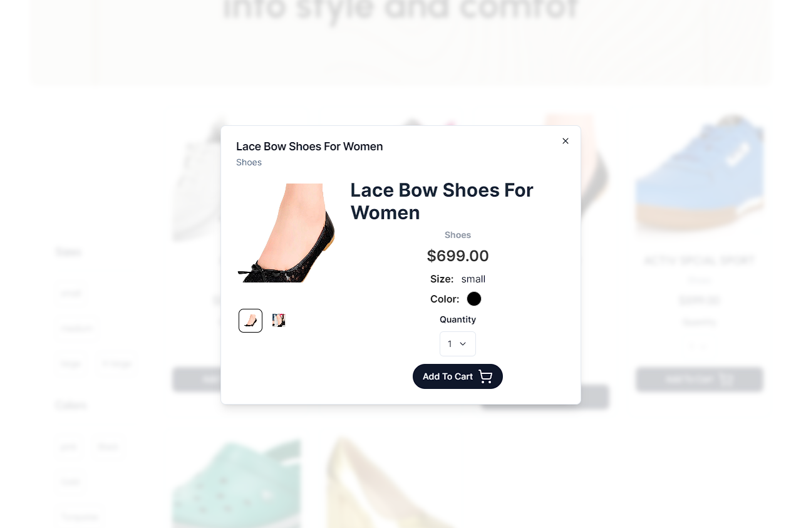

&nbsp;&nbsp;&nbsp;&nbsp;&nbsp;&nbsp;

  <h1 align="center">Mercato</h1>

 <a href="https://mercato-app-khaled.vercel.app/">

</a>

## Introduction

Mercato E-commerce web app built with reactJS + supabase storage + supabase DB + supabase edge functions + shadcn ui + clerkJs for auth with functionality of payment using stripe, dark mode and roles of admins adn users.

Explore my demo Mercato (e-commerce) app.

## Main Technologies used

  

<h1>ADMIN Dashboard demo Credentrials</h1>
  <a style="display:block;justify-content:center;margin-bottom:1rem; font-weight:bold;" href="https://mercato-app-khaled-934nlx9fw-khaleddrashadd.vercel.app/admin">Admin Dashboard Demo</a>
<h3>E-Mail: (demoappecommerce@gmail.com)</h3>
<h3>Password: (mercatoapp)</h3>

## Support

If you like my work, feel free to:

- ⭐ this repository. It helps.

### Create a bug report

If you see an error message or run into an issue, please [create bug report](https://github.com/khaleddrashadd/e-commerce/issues). This effort is valued.
